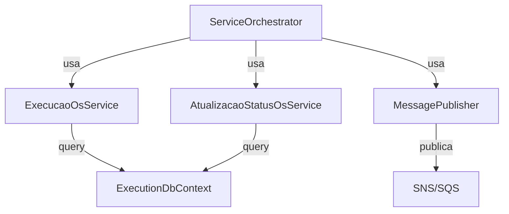

# 🏗️ Arquitetura do ExecutionService

## 📋 Índice
1. [Visão Geral Arquitetural](#1-visão-geral-arquitetural)
2. [Estrutura de Camadas](#2-estrutura-de-camadas)
3. [Fluxos de Negócio Principais](#3-fluxos-de-negócio-principais)
4. [Padrões de Design](#4-padrões-de-design)
5. [Integrações Externas](#5-integrações-externas)
6. [Banco de Dados](#6-banco-de-dados)
7. [Segurança](#7-segurança)
8. [Observabilidade](#8-observabilidade)
9. [Deployment](#9-deployment)
10. [Decisões Arquiteturais](#10-decisões-arquiteturais)

---

## 1. Visão Geral Arquitetural

### Responsabilidade Primária

ExecutionService é um **microserviço event-driven** responsável pela **orquestração e execução de ordens de serviço** na plataforma OficinaCardozo. Integra-se:

- **Upstream** (BillingService): Recebe eventos de `PaymentConfirmed` via SNS/SQS
- **Downstream**: Publica eventos `ExecutionStarted`, `ExecutionFinished`, `ExecutionCanceled` para outros serviços
- **Banco de Dados**: PostgreSQL para persistência de estado de execução

### Responsabilidades

| Responsabilidade | Descrição |
|-----------------|-----------|
| **Criar Execução** | Registra nova ordem de serviço após pagamento confirmado |
| **Gerenciar Ciclo de Vida** | Transições de estado: Fila → Diagnóstico → Reparo → Finalizado |
| **Cancelar Execução** | Remove ordem de serviço quando cliente cancela |
| **Registrar Status** | Mantém histórico de mudanças de status |
| **Publicar Eventos** | Notifica sistemas downstream sobre progresso da execução |
| **Garantir Idempotência** | Inbox/Outbox evitam duplicação em caso de falhas de entrega |

### Diagrama de Contexto

```
┌─────────────────────────────────────────────────────────────┐
│                    OFICINACARDOZO                            │
└─────────────────────────────────────────────────────────────┘
         ↓                                        ↓
    ┌─────────────┐                      ┌──────────────┐
    │   Billing   │                      │   Notif      │
    │  Service    │                      │  Service     │
    └──────┬──────┘                      └──────▲───────┘
           │                                    │
         SNS Topic: PaymentConfirmed            │
           │                                    │
      ┌────▼────────────────────────┐          │
      │  SQS Queue: PaymentEvents    │          │
      └────┬────────────────────────┘          │
           │                                    │
    ┌──────▼──────────────────────────────────┐│
    │        EXECUTION SERVICE                 ││
    │  ┌────────────────────────────────────┐ ││
    │  │  Application Layer                 │ ││  SNS Topic:
    │  │  • ExecucaoOsService              │ ││  ExecutionFinished
    │  │  • AtualizacaoStatusOsService     │ ││
    │  │  • ServiceOrchestrator            │ ││
    │  └────────────────────┬───────────────┘ ││
    │                       │                  ││
    │  ┌────────────────────▼───────────────┐ ││
    │  │  Domain Layer                      │ ││
    │  │  • ExecucaoOs                      │◄┤┤
    │  │  • ExecutionJob                    │ ││
    │  │  • AtualizacaoStatusOs             │ ││
    │  └────────────────────────────────────┘ ││
    │                                         ││
    │  ┌────────────────────────────────────┐ ││
    │  │  Messaging Layer                   │◄┘│
    │  │  • InboxService (dedup)            │  │
    │  │  • OutboxService (publish)         │  │
    │  │  • SNS/SQS Consumers               │  │
    │  │  • SNS/SQS Publishers              │  │
    │  └────────────────────────────────────┘  │
    │                                          │
    │  ┌────────────────────────────────────┐  │
    │  │  Data Layer (PostgreSQL)           │  │
    │  │  • ExecucaoOs                      │  │
    │  │  • ExecutionJob                    │  │
    │  │  • AtualizacaoStatusOs             │  │
    │  │  • InboxEvent                      │  │
    │  │  • OutboxEvent                     │  │
    │  └────────────────────────────────────┘  │
    └─────────────────────────────────────────┘
```

---

## 2. Estrutura de Camadas

### 🔼 API Layer (`src/API/`)

**Responsabilidade**: HTTP endpoints e middleware cross-cutting

#### Controllers

```csharp
ExecutionController
├── POST /api/execution        → CriarExecucao()
├── GET  /api/execution/{id}   → ObterExecucao()
├── PUT  /api/execution/{id}/status → AtualizarStatus()
├── PUT  /api/execution/{id}/diagnostico → AtualizarDiagnostico()
└── PUT  /api/execution/{id}/reparo → AtualizarReparo()

TestingController (apenas dev)
├── DELETE /api/testing/clear-all → LimparTodos()
```

#### Middleware

| Middleware | Responsabilidade |
|-----------|------------------|
| `CorrelationIdMiddleware` | Injeta correlation ID em todas as requisições |
| `ExceptionHandlingMiddleware` | Captura exceções, formata JSON, loga com Serilog |
| `ValidationFilter` | Valida DTO entrada, retorna 400 Bad Request |

**Diagrama de Trade-off**: O middleware `ExceptionHandlingMiddleware` faz duplo processamento com `ValidationFilter` para DataAnnotations - veja Decisões Arquiteturais.

---

### 🎯 Application Layer (`src/Application/`)

**Responsabilidade**: Lógica de negócio, orquestração

#### Services



**ExecucaoOsService**
```csharp
public class ExecucaoOsService
{
    // GET: Retrieves by ordem_servico_id
    Task<ExecucaoOs?> ObterExecucaoAsync(Guid ordemServicoId)
    
    // CREATE: Initial status = Fila
    Task<ExecucaoOs> CriarExecucaoAsync(Guid ordemServicoId)
    
    // UPDATE: Status transitions
    Task AtualizarStatusAsync(Guid id, ExecutionStatus novoStatus)
    Task AtualizarDiagnosticoAsync(Guid id, string diagnostico)
    Task AtualizarRepuroAsync(Guid id, string reparo)
}
```

**AtualizacaoStatusOsService**
```csharp
public class AtualizacaoStatusOsService
{
    // Record status changes for audit trail
    Task<ICollection<AtualizacaoStatusOs>> 
        ObterAtualizacoesAsync(Guid ordemServicoId)
    
    Task RegistrarAtualizacaoAsync(Guid ordemServicoId, 
                                   ExecutionStatus status)
}
```

---

### 💎 Domain Layer (`src/Domain/`)

**Responsabilidade**: Modelos de domínio, state machine, business rules

#### Entidades

```csharp
public class ExecucaoOs : IEntity
{
    public Guid Id { get; set; }
    public Guid OrdemServicoId { get; set; }
    public ExecutionStatus StatusAtual { get; set; }
    public string? Diagnostico { get; set; }
    public string? Reparo { get; set; }
    public bool Finalizado { get; set; }
    
    public DateTime InicioExecucao { get; set; }
    public DateTime? FimExecucao { get; set; }
    public DateTime CriadoEm { get; set; }
    public DateTime AtualizadoEm { get; set; }
}

public class ExecutionJob : IEntity
{
    public Guid Id { get; set; }
    public Guid OrdemServicoId { get; set; }
    public Guid ExecucaoId { get; set; }
    
    public ExecutionStatus Status { get; set; }  // State
    public DateTime? FinishedAt { get; set; }
    public DateTime CreatedAt { get; set; }
    public DateTime UpdatedAt { get; set; }
}

public enum ExecutionStatus
{
    Queued = 0,          // Fila
    Diagnosing = 1,      // Em Diagnóstico
    Repairing = 2,       // Em Reparo
    Finished = 3,        // Finalizado
    Failed = 4,          // Falha
    Canceled = 5         // Cancelado
}

public class AtualizacaoStatusOs : IEntity
{
    public Guid Id { get; set; }
    public Guid OrdemServicoId { get; set; }
    public ExecutionStatus StatusAnterior { get; set; }
    public ExecutionStatus StatusNovo { get; set; }
    public DateTime DataAtualizacao { get; set; }
}
```

#### State Machine

```
Queued
  ├─→ Diagnosing (via PaymentConfirmed)
  │     ├─→ Repairing (via manual transition)
  │     │     └─→ Finished (final state)
  │     └─→ Finished (diagnostic complete)
  │
  ├─→ Failed (via system error)
  │     └─ (terminal - no escape)
  │
  └─→ Canceled (via OsCanceled event)
       └─ (terminal - no escape)

Terminal States: Finished, Failed, Canceled
```

**Validações de Domínio**:
```csharp
// Não pode transicionar de estado terminal
if (currentStatus == ExecutionStatus.Finished 
    && newStatus != ExecutionStatus.Finished)
    throw new InvalidOperationException("Cannot transition from Finished");

// Fila pode ir para Diagnosing ou Canceled
if (currentStatus == ExecutionStatus.Queued 
    && newStatus != ExecutionStatus.Diagnosing 
    && newStatus != ExecutionStatus.Canceled)
    throw new InvalidStateTransitionException();
```

---

### 📨 Event Handlers (`src/EventHandlers/`)

**Responsabilidade**: Consumir eventos, atualizar estado local

```csharp
public class PaymentConfirmedHandler : INotificationHandler<PaymentConfiriredEvent>
{
    // 1. Registra evento em Inbox (prevenção de duplicata)
    // 2. Cria ExecucaoOs com status Fila
    // 3. Cria ExecutionJob com status Diagnosing
    // 4. Publica ExecutionStarted no Outbox
    // 5. Publica para SNS
    
    public async Task Handle(PaymentConfirmedEvent @event)
    {
        // @event.OrdemServicoId → origem
        // @event.EventId → para deduplicação
    }
}

public class OsCanceledHandler : INotificationHandler<OsCanceledEvent>
{
    // 1. Registra evento em Inbox
    // 2. Busca ExecutionJob ativo
    // 3. Transiciona para Canceled
    // 4. Define UpdatedAt
    // 5. Publica ExecutionCanceled
    
    public async Task Handle(OsCanceledEvent @event)
    {
        // Idempotent: se já está Canceled, ignora
    }
}
```

---

### 📬 Messaging Layer (`src/Messaging/`)

**Responsabilidade**: SNS/SQS integration, idempotency patterns

#### Transactional Outbox

```csharp
public class OutboxService
{
    // Publica eventos que falharam anterior
    Task PublishUnpublishedEventsAsync()
    {
        var events = _db.OutboxEvents
            .Where(x => !x.Published)
            .ToListAsync();
        
        foreach (var evt in events)
        {
            await _snsPub.PublishAsync(evt);
            evt.Published = true;
            evt.PublishedAt = DateTime.UtcNow;
        }
    }
}

public class OutboxEvent
{
    public Guid Id { get; set; }
    public string EventType { get; set; }      // "ExecutionStarted"
    public string Payload { get; set; }        // JSON
    public bool Published { get; set; } = false;
    public DateTime? PublishedAt { get; set; }
    public DateTime CreatedAt { get; set; } = DateTime.UtcNow;
}
```

#### Transactional Inbox

```csharp
public class InboxService
{
    // Previne processamento duplicado
    Task<bool> IsDuplicateAsync(string eventId)
    {
        return _db.InboxEvents
            .AnyAsync(x => x.EventId == eventId);
    }
    
    Task AddEventAsync(string eventId, string eventType, string payload)
    {
        var inboxEvent = new InboxEvent
        {
            EventId = eventId,
            EventType = eventType,
            Payload = payload,
            Processed = false
        };
        _db.InboxEvents.Add(inboxEvent);
        await _db.SaveChangesAsync();
    }
}

public class InboxEvent
{
    public Guid Id { get; set; }
    public string EventId { get; set; }
    public string EventType { get; set; }     // "PaymentConfirmed"
    public string Payload { get; set; }       // JSON
    public bool Processed { get; set; } = false;
    public DateTime ProcessedAt { get; set; }
    public DateTime CreatedAt { get; set; } = DateTime.UtcNow;
}
```

#### Amazon SQS/SNS Config

```csharp
public class MessagingConfig
{
    // Consumer
    SQS Queue: "payment-events-queue"
    Dead Letter: "payment-events-queue-dlq"
    Message Retention: 4 dias
    Visibility Timeout: 60s
    
    // Publisher  
    SNS Topic: "execution-events-topic"
    Subscription: Multiple external topics
    DeliveryPolicy: Retry pattern com DLQ
}

public class SqsConsumer
{
    // Long-polling: 20s wait time
    // Batch: 10 messages per poll
    // Delete after processing
    // Exponential backoff on error → DLQ
}

public class SnsPublisher
{
    // Publish with retry (built-in AWS behavior)
    // Message attributes included
    // Tracking via TraceId/CorrelationId
}
```

---

### 🗄️ Data Layer

```csharp
public class ExecutionDbContext : DbContext
{
    DbSet<ExecucaoOs> ExecucaoOs { get; set; }
    DbSet<AtualizacaoStatusOs> AtualizacaoStatusOs { get; set; }
    DbSet<ExecutionJob> ExecutionJobs { get; set; }
    DbSet<InboxEvent> InboxEvents { get; set; }
    DbSet<OutboxEvent> OutboxEvents { get; set; }
}
```

---

## 3. Fluxos de Negócio Principais

### 3.1 Fluxo: Criar Execução após Pagamento

```
EXTERNO: BillingService Payment Confirmed
    │
    ├─→ [SNS Topic: payment-confirmed]
    │     │
    │     ├─→ [SQS Queue: payment-events-queue]
    │           │
    │           └─→ [SqsConsumer Worker]
    │                 │
    │                 ▼
    │  ┌──────────────────────────────────┐
    │  │ PaymentConfirmedHandler.Handle()  │
    │  │  1. Check Inbox (duplicate?)      │
    │  │  2. Add to Inbox                  │
    │  │  3. Create ExecucaoOs (Fila)      │
    │  │  4. Create ExecutionJob (Diagnosing) │
    │  │  5. Add to Outbox (ExecutionStarted) │
    │  │  6. Save to PostgreSQL [ACID]     │
    │  └────────┬─────────────────────────┘
    │           │
    │           ▼
    │  ┌──────────────────────────────┐
    │  │ OutboxService.PublishAsync()  │
    │  │ → SNS: ExecutionStarted       │
    │  └──────────────────────────────┘
    │
    └─→ [RESULT] Notification Services alerted
        Maintenance team can proceed with diagnosis
```

**Garantias**:
- ✅ Exactly-once semantics via Inbox (EventId deduplication)
- ✅ Eventual consistency via Outbox (retry on failure)
- ✅ Transaction boundary: single SaveChangesAsync()

---

### 3.2 Fluxo: Atualizar Status de Execução

```
INTERNO: Technician updates diagnosis via API
    │
    ├─→ [PUT /api/execution/{id}/diagnostico]
    │     │
    │     ▼
    │  ┌──────────────────────────────────┐
    │  │ ExecutionController              │
    │  │  1. Validate JWT Token           │
    │  │  2. Parse DTO                    │
    │  │  3. Check Data Annotations       │
    │  └────────┬─────────────────────────┘
    │           │
    │           ▼
    │  ┌──────────────────────────────────┐
    │  │ ExecucaoOsService.AtualizarDiagnosticoAsync() │
    │  │  1. Fetch ExecucaoOs by Id       │
    │  │  2. Validate state (not Finished) │
    │  │  3. Update Diagnostico field     │
    │  │  4. Set AtualizadoEm = UtcNow    │
    │  └────────┬─────────────────────────┘
    │           │
    │           ▼
    │  ┌──────────────────────────────────┐
    │  │ AtualizacaoStatusOsService       │
    │  │  .RegistrarAtualizacaoAsync()    │
    │  │  Creates audit trail record      │
    │  └────────┬─────────────────────────┘
    │           │
    │           ▼
    │  ┌──────────────────────────────────┐
    │  │ DbContext.SaveChangesAsync()     │
    │  │ [PostgreSQL ACID Transaction]    │
    │  │  - ExecucaoOs updated            │
    │  │  - AtualizacaoStatusOs inserted  │
    │  │  - Committed or rolled back      │
    │  └────────┬─────────────────────────┘
    │           │
    │           ▼
    │  [200 OK] Response to technician
    │  
```

**Mediação de Conflitos**:
- Optimistic locking: Não implementado (assume single technician)
- Versioning: Usa timestamps (AtualizadoEm) para ordering

---

### 3.3 Fluxo: Cancelar Execução

```
EXTERNO: OsCanceled Event from Order System
    │
    ├─→ [SNS Topic: order-canceled-topic]
    │     │
    │     └─→ [SQS Queue: order-events-queue]
    │           │
    │           └─→ [SqsConsumer Worker]
    │                 │
    │                 ▼
    │  ┌──────────────────────────────────┐
    │  │ OsCanceledHandler.Handle()        │
    │  │  1. Check Inbox (duplicate?)      │
    │  │  2. Add to Inbox                  │
    │  │  3. Find ExecutionJob by OsId     │
    │  │  4. If Status NOT Terminal:       │
    │  │     → Status = Canceled           │
    │  │     → UpdatedAt = UtcNow          │
    │  │  5. Add to Outbox (ExecutionCanceled) │
    │  │  6. Save [ACID]                   │
    │  └────────┬─────────────────────────┘
    │           │
    │           ▼
    │  ┌──────────────────────────────────┐
    │  │ OutboxService.PublishAsync()      │
    │  │ → SNS: ExecutionCanceled          │
    │  └──────────────────────────────────┘
    │
    └─→ [RESULT] Cancellation confirmed
        No refund or penalties on ExecutionService
```

**Idempotency**:
- Se handler é chamado 2x com mesmo EventId?
  1. Inbox.IsDuplicateAsync() retorna true
  2. Handler sai sem processar
  3. Event considerado completo

---

## 4. Padrões de Design

### 4.1 Transactional Outbox Pattern

**Problema**: Publicar evento e salvar estado atomicamente

**Solução**: Duas transactions, uma local

```
┌─────────────────────────────────────────┐
│ Local Transaction (PostgreSQL)           │
│ 1. INSERT ExecucaoOs                    │
│ 2. INSERT OutboxEvent (Published=false) │
│ 3. COMMIT                                │
└─────────────────────────────────────────┘
         ↓ (mesmo DB, guaranteed)
┌─────────────────────────────────────────┐
│ Separate Worker Thread                   │
│ 1. Query OutboxEvents WHERE Published=false │
│ 2. For each event:                       │
│    - Publish to SNS                     │
│    - If success: UPDATE Published=true  │
│    - If fail: Retry with backoff        │
│    - If DLQ: Manual investigation       │
└─────────────────────────────────────────┘
```

**Garantias**:
- ✅ Não há "ghost events" (evento perdido)
- ✅ Crash-safe: Outbox evento persiste
- ✅ Eventually consistent: Publicado assinc

---

### 4.2 Transactional Inbox Pattern

**Problema**: Processar SQS event sem duplicata se app crashes

**Solução**: Registrar no Inbox antes de processar

```
────────────────────────────────────────────────

CENÁRIO: SQS delivers "PaymentConfirmed" 

Attempt #1:
  1. Handler checks Inbox.IsDuplicate("evt-123") → false
  2. Handler creates ExecucaoOs
  3. Handler adds to OutboxEvent
  4. DB.SaveChanges() → NETWORK ERROR
  5. SQS visibility timeout expires
  6. Message re-delivered

Attempt #2:
  1. Handler checks Inbox.IsDuplicate("evt-123") → true ✅
  2. Handler returns without processing
  3. Message deleted from SQS

RESULT: ExecucaoOs created exactly-once ✓
```

---

### 4.3 Event Sourcing (Partial)

**Implementação**: AtualizacaoStatusOs como append-only log

```csharp
// Não é "true" event sourcing (estado guardado em ExecucaoOs)
// Mas fornece audit trail para todos os status changes

var history = await _statusService.ObterAtualizacoesAsync(ordemId);
// [
//   { id: 1, status: Queued,    timestamp: 2024-02-23 10:00 },
//   { id: 2, status: Diagnosing, timestamp: 2024-02-23 10:15 },
//   { id: 3, status: Finished,   timestamp: 2024-02-23 11:30 }
// ]
```

---

### 4.4 Event-Driven Architecture

```
                    ┌─────────────────┐
                    │  Event Bus      │
                    │  (AWS SNS/SQS)  │
                    └────────┬────────┘
                             │
            ┌────────────────┼────────────────┐
            │                │                │
            ▼                ▼                ▼
      [Billing]        [Execution]      [Notification]
      listens          listens           listens
      PaymentConfirmed ExecutionStarted ExecutionFinished
```

**Benefícios**:
- ✅ Services desacoplados
- ✅ Escalável (SQS auto-scales)
- ⚠️ Eventual consistency (trade-off)
- ⚠️ Debugging complexo (distributed tracing obrigatório)

---

### 4.5 Service Locator / DI Container

```csharp
// Program.cs
services.AddScoped<IExecucaoOsService, ExecucaoOsService>();
services.AddScoped<IAtualizacaoStatusOsService, AtualizacaoStatusOsService>();
services.AddScoped<IInboxService, InboxService>();
services.AddScoped<IOutboxService, OutboxService>();

// Handlers
services.AddMediatR(cfg =>
{
    cfg.RegisterServicesFromAssembly(typeof(Program).Assembly);
});

// AWS Services
services.AddAWSService<IAmazonSQS>();
services.AddAWSService<IAmazonSimpleNotificationService>();
```

---

### 4.6 Repository Pattern (via EF Core DbSet)

```csharp
// NOT explicit repositories - using DbContext directly
// (Implicit repository via DbSet<T>)

public class ExecucaoOsService
{
    private readonly ExecutionDbContext _db;
    
    public async Task<ExecucaoOs?> ObterExecucaoAsync(Guid id)
    {
        return await _db.ExecucaoOs.FirstOrDefaultAsync(x => x.Id == id);
    }
}

// FUTURE IMPROVEMENT: Explicit IRepository<T> interface
// for better testability (currently using InMemory DbContext)
```

---

## 5. Integrações Externas

### 5.1 AWS SNS (Publish)

```yaml
Topic ARN: arn:aws:sns:us-east-1:ACCOUNT:execution-events-topic

Events Publicados:
├─ ExecutionStarted
│   Payload: { OrdemServicoId, ExecucaoId, EventId, Timestamp }
│   Subscribers: [Notification Service, Analytics]
│
├─ ExecutionFinished  
│   Payload: { OrdemServicoId, ExecucaoId, Diagnostico, Reparo, Timestamp }
│   Subscribers: [Billing Service, Notification Service]
│
└─ ExecutionCanceled
    Payload: { OrdemServicoId, ExecucaoId, Timestamp }
    Subscribers: [Billing Service, Notification Service]
```

### 5.2 AWS SQS (Consume)

```yaml
Queue ARN: arn:aws:sqs:us-east-1:ACCOUNT:payment-events-queue

Events Consumidos:
├─ PaymentConfirmed (from BillingService)
│   Handler: PaymentConfirmedHandler
│   Processing: Create ExecutionJob, Publish ExecutionStarted
│
└─ OsCanceled (from OrderService)
    Handler: OsCanceledHandler
    Processing: Cancel ExecutionJob, Publish ExecutionCanceled
```

Configuration:
```csharp
public class SqsConsumer
{
    private const string QueueUrl = "https://sqs.us-east-1.amazonaws.com/ACCOUNT/payment-events-queue";
    private const int MessageWaitTime = 20;  // Long-polling
    private const int MaxNumberOfMessages = 10;  // Batch
    
    public async Task ConsumeAsync(CancellationToken ct)
    {
        while (!ct.IsCancellationRequested)
        {
            var request = new ReceiveMessageRequest
            {
                QueueUrl = QueueUrl,
                WaitTimeSeconds = MessageWaitTime,
                MaxNumberOfMessages = MaxNumberOfMessages,
                MessageAttributeNames = new List<string> { "All" }
            };
            
            var response = await _sqs.ReceiveMessageAsync(request, ct);
            
            foreach (var message in response.Messages)
            {
                try
                {
                    var @event = JsonConvert.DeserializeObject<PaymentConfirmedEvent>(message.Body);
                    await _mediator.Send(new PaymentConfirmedCommand(@event));
                    
                    // Delete after successful processing
                    await _sqs.DeleteMessageAsync(QueueUrl, message.ReceiptHandle, ct);
                }
                catch (Exception ex)
                {
                    _logger.LogError(ex, "Error processing message {MessageId}", message.MessageId);
                    // Message visibility timeout expires → auto-retry
                    // After max retries → moves to DLQ
                }
            }
        }
    }
}
```

### 5.3 JWT Token Validation

```csharp
// In Program.cs
services.AddAuthentication(JwtBearerDefaults.AuthenticationScheme)
    .AddJwtBearer(options =>
    {
        options.Authority = "https://auth.oficinacardozo.com";
        options.Audience = "execution-service";
        options.TokenValidationParameters = new TokenValidationParameters
        {
            ValidateIssuer = true,
            ValidateAudience = true,
            ValidateIssuerSigningKey = true,
            ClockSkew = TimeSpan.FromSeconds(10)
        };
    });

// In Controller
[Authorize]
[HttpPost("/api/execution")]
public async Task<IActionResult> CriarExecucao([FromBody] CriarExecucaoDto dto)
{
    var userId = User.FindFirst("sub")?.Value;
    var userRole = User.FindFirst("role")?.Value;  // "technician", "admin"
    
    if (userRole != "technician")
        return Forbid();
    
    // ... create execution ...
}
```

---

## 6. Banco de Dados

### 6.1 Schema PostgreSQL

```sql
-- Main execution entity
CREATE TABLE execucao_os (
    id UUID PRIMARY KEY DEFAULT gen_random_uuid(),
    ordem_servico_id UUID NOT NULL UNIQUE,
    status_atual INT NOT NULL DEFAULT 0,  -- ExecutionStatus enum
    diagnostico TEXT,
    reparo TEXT,
    finalizado BOOLEAN NOT NULL DEFAULT false,
    
    inicio_execucao TIMESTAMP NOT NULL DEFAULT CURRENT_TIMESTAMP,
    fim_execucao TIMESTAMP,
    criado_em TIMESTAMP NOT NULL DEFAULT CURRENT_TIMESTAMP,
    atualizado_em TIMESTAMP NOT NULL DEFAULT CURRENT_TIMESTAMP
);

-- Audit trail - append-only
CREATE TABLE atualizacao_status_os (
    id UUID PRIMARY KEY DEFAULT gen_random_uuid(),
    ordem_servico_id UUID NOT NULL,
    status_anterior INT NOT NULL,
    status_novo INT NOT NULL,
    data_atualizacao TIMESTAMP NOT NULL DEFAULT CURRENT_TIMESTAMP,
    
    FOREIGN KEY (ordem_servico_id) REFERENCES execucao_os(ordem_servico_id)
);
CREATE INDEX idx_atualizacao_os_id ON atualizacao_status_os(ordem_servico_id);

-- Job execution state machine
CREATE TABLE execution_job (
    id UUID PRIMARY KEY DEFAULT gen_random_uuid(),
    ordem_servico_id UUID NOT NULL,
    execucao_id UUID NOT NULL,
    status INT NOT NULL DEFAULT 0,  -- ExecutionStatus enum
    finished_at TIMESTAMP,
    created_at TIMESTAMP NOT NULL DEFAULT CURRENT_TIMESTAMP,
    updated_at TIMESTAMP NOT NULL DEFAULT CURRENT_TIMESTAMP,
    
    FOREIGN KEY (execucao_id) REFERENCES execucao_os(id)
);

-- Idempotency: Inbox pattern
CREATE TABLE inbox_event (
    id UUID PRIMARY KEY DEFAULT gen_random_uuid(),
    event_id VARCHAR(255) NOT NULL UNIQUE,  -- From external system
    event_type VARCHAR(255) NOT NULL,
    payload JSONB NOT NULL,
    processed BOOLEAN NOT NULL DEFAULT false,
    processed_at TIMESTAMP,
    created_at TIMESTAMP NOT NULL DEFAULT CURRENT_TIMESTAMP
);
CREATE INDEX idx_inbox_event_id ON inbox_event(event_id);

-- Reliability: Outbox pattern
CREATE TABLE outbox_event (
    id UUID PRIMARY KEY DEFAULT gen_random_uuid(),
    event_type VARCHAR(255) NOT NULL,
    payload JSONB NOT NULL,
    published BOOLEAN NOT NULL DEFAULT false,
    published_at TIMESTAMP,
    created_at TIMESTAMP NOT NULL DEFAULT CURRENT_TIMESTAMP
);
CREATE INDEX idx_outbox_published ON outbox_event(published);
```

### 6.2 Migration Strategy

```bash
# Create migration
dotnet ef migrations add AddExecutionTables

# Apply migration
dotnet ef database update

# Check pending migrations
dotnet ef migrations list

# Revert to previous
dotnet ef database update PreviousMigrationName
```

**Migration Sequence**:
1. `001_CreateExecutionTables` - Initial schema
2. `002_AddAuditTrail` - AtualizacaoStatusOs table
3. `003_AddEventPatterns` - InboxEvent, OutboxEvent
4. `004_AddIndexes` - Performance optimization

### 6.3 Connection String (Environment-based)

```csharp
// Program.cs
var connString = builder.Configuration.GetConnectionString("DefaultConnection");
// Development: "Host=localhost;Database=oficina_execution_dev;User Id=postgres;Password=dev"
// Staging:     "Host=postgres-staging.rds.amazonaws.com;Database=oficina_execution_stg;..."
// Production:  "Host=postgres-prod.rds.amazonaws.com;Database=oficina_execution_prod;..."

services.AddDbContext<ExecutionDbContext>(options =>
    options.UseNpgsql(connString, npgsqlOptions =>
    {
        npgsqlOptions.EnableRetryOnFailure(
            maxRetryCount: 3,
            maxRetryDelaySeconds: 5,
            errorCodesToAdd: new[] { "40P01" }  // Deadlock
        );
    })
);
```

---

## 7. Segurança

### 7.1 Authentication & Authorization

```csharp
// Middleware chain
app.UseAuthentication();  // ← Validates JWT token
app.UseAuthorization();   // ← Checks [Authorize] attribute

// Controller enforcement
[ApiController]
[Route("api/[controller]")]
[Authorize]  // ← Requires valid JWT bearer token
public class ExecutionController : ControllerBase
{
    [HttpPost]
    [Authorize(Roles = "technician,admin")]
    public async Task<IActionResult> CriarExecucao([FromBody] CriarExecucaoDto dto)
    {
        // User claims available
        var userId = User.FindFirst(ClaimTypes.NameIdentifier)?.Value;
        var department = User.FindFirst("department")?.Value;
        
        // Log who made the request
        _logger.LogInformation("User {UserId} from {Department} created execution", 
                               userId, department);
        
        // ... validation and processing ...
    }
}
```

### 7.2 HTTPS/TLS

```yaml
# Kubernetes Ingress with TLS termination
apiVersion: networking.k8s.io/v1
kind: Ingress
metadata:
  name: execution-service-ingress
spec:
  tls:
  - hosts:
    - execution-service.oficinacardozo.com
    secretName: execution-tls-secret
  rules:
  - host: execution-service.oficinacardozo.com
    http:
      paths:
      - path: /
        pathType: Prefix
        backend:
          service:
            name: execution-service
            port:
              number: 5000
```

### 7.3 Input Validation via DataAnnotations

```csharp
public class CriarExecucaoDto
{
    [Required]
    [StringLength(100)]
    public string? NomeExecucao { get; set; }
    
    [Required]
    [GuidFormat]  // Custom validator
    public Guid OrdemServicoId { get; set; }
    
    [Range(0, int.MaxValue)]
    public int TempoEstimado { get; set; }
}

// Validation Filter
[AttributeUsage(AttributeTargets.Class | AttributeTargets.Method)]
public class ValidationFilterAttribute : ActionFilterAttribute
{
    public override void OnActionExecuting(ActionExecutingContext context)
    {
        if (!context.ModelState.IsValid)
        {
            var errors = context.ModelState.Values.SelectMany(v => v.Errors);
            context.Result = new BadRequestObjectResult(new
            {
                status = "error",
                message = "Validation failed",
                errors = errors.Select(e => e.ErrorMessage)
            });
        }
    }
}
```

### 7.4 SQL Injection Prevention

```csharp
// ❌ VULNERABLE: String concatenation
var sql = $"SELECT * FROM execucao_os WHERE id = {id}";
var result = _db.ExecucaoOs.FromSqlRaw(sql);

// ✅ SAFE: Parameterized queries via EF Core
var result = await _db.ExecucaoOs
    .Where(x => x.Id == id)
    .FirstOrDefaultAsync();

// ✅ SAFE: If using raw SQL, use parameters
var result = await _db.ExecucaoOs
    .FromSqlInterpolated($"SELECT * FROM execucao_os WHERE id = {id}")
    .ToListAsync();
```

### 7.5 Secrets Management

```csharp
// ❌ WRONG: Hardcoded secrets
const string ApiKey = "sk-123456";

// ✅ CORRECT: User Secrets (dev) or AWS Secrets Manager (prod)
var apiKey = configuration["AWS:ApiKey"];

// In appsettings.json (version controlled)
{
  "AWS": {
    "ApiKey": "${AWS_API_KEY}"  // Environment variable
  }
}

// In Kubernetes Secret
apiVersion: v1
kind: Secret
metadata:
  name: execution-service-secrets
type: Opaque
stringData:
  AWS_API_KEY: "sk-123456"
```

---

## 8. Observabilidade

### 8.1 Structured Logging (Serilog)

```csharp
// Program.cs
Log.Logger = new LoggerConfiguration()
    .MinimumLevel.Debug()
    .Enrich.FromLogContext()
    .Enrich.WithProperty("Service", "ExecutionService")
    .WriteTo.Console(new CompactJsonFormatter())
    .WriteTo.File("logs/execution-.txt",
        rollingInterval: RollingInterval.Day,
        outputTemplate: "{Timestamp:yyyy-MM-dd HH:mm:ss.fff} [{Level:u3}] {Message:lj}{NewLine}{Exception}")
    .WriteTo.AmazonCloudWatch(
        logGroup: "/aws/ecs/execution-service",
        textFormatter: new JsonFormatter())
    .CreateLogger();

// Usage in handler
public class PaymentConfirmedHandler
{
    public async Task Handle(PaymentConfirmedEvent @event)
    {
        using var logScope = _logger.BeginScope(
            "EventId: {EventId}, OrdemServicoId: {OrdemServicoId}",
            @event.EventId,
            @event.OrdemServicoId);
        
        _logger.LogInformation("Processing payment confirmed event");
        // Log output: 
        // {
        //   "@t": "2024-02-23T10:15:30.1234567Z",
        //   "@m": "Processing payment confirmed event",
        //   "@l": "Information",
        //   "Service": "ExecutionService",
        //   "EventId": "evt-abc123",
        //   "OrdemServicoId": "os-xyz789"  
        // }
    }
}
```

### 8.2 Correlation ID Tracing

```csharp
// Middleware injects correlation ID
public class CorrelationIdMiddleware
{
    public async Task InvokeAsync(HttpContext context)
    {
        var correlationId = context.Request.Headers
            .GetCommaSeparatedValues("Correlation-Id")
            .FirstOrDefault() ?? Guid.NewGuid().ToString();
        
        context.Items["CorrelationId"] = correlationId;
        
        using var logScope = _logger.BeginScope(
            "CorrelationId: {CorrelationId}", 
            correlationId);
        
        context.Response.Headers.Add("Correlation-Id", correlationId);
        await _next(context);
    }
}

// All logs inherit correlation ID
// Enables tracing across microservices:
//   ExecutionService log 1 → CorrelationId: "abc-123"
//            ↓ publishes ExecutionStarted
//   NotificationService log 1 → CorrelationId: "abc-123"  (same ID!)
```

### 8.3 Metrics & Prometheus

```csharp
// Counter: Track event processing
var paymentEventsCounter = new Counter(
    "payment_confirmed_events_total",
    "Total number of PaymentConfirmed events processed");

// Histogram: Track latency
var executionLatencyHistogram = new Histogram(
    "execution_creation_duration_seconds",
    "Time taken to create execution");

// Handler
public async Task Handle(PaymentConfirmedEvent @event)
{
    using (executionLatencyHistogram.NewTimer())
    {
        await _service.CriarExecucaoAsync(@event.OrdemServicoId);
        paymentEventsCounter.Inc();
    }
}

// Prometheus scrape endpoint
app.MapMetrics();  // /metrics
```

Prometheus query examples:
```
# Average latency over last 5 minutes
rate(execution_creation_duration_seconds_sum[5m]) / rate(execution_creation_duration_seconds_count[5m])

# Error rate
rate(errors_total[5m]) / rate(requests_total[5m])
```

### 8.4 CloudWatch Integration

```csharp
// Logs automatically sent to CloudWatch via Serilog sink
// View in AWS Console:
// CloudWatch → Log Groups → /aws/ecs/execution-service

// Query syntax (CloudWatch Insights):
fields @timestamp, @message, Service, CorrelationId
| filter @message like /ERROR/
| stats count() by Service
```

### 8.5 Distributed Tracing (via CorrelationId)

```
┌─────────────────────────────────────────────────────┐
│ Request Flow with Tracing                            │
├─────────────────────────────────────────────────────┤
│ Client Request                                       │
│ → Correlation-Id: f47ac10b-58cc-4372-a567-0e02b2c3d479
│                                                      │
│ ExecutionService                                     │
│ 2024-02-23 10:15:30 [INFO] Processing payment      │
│   CorrelationId: f47ac10b-...                       │
│ 2024-02-23 10:15:31 [INFO] Created execution       │
│   CorrelationId: f47ac10b-...                       │
│ 2024-02-23 10:15:31 [INFO] Publishing event        │
│   CorrelationId: f47ac10b-...                       │
│                                                      │
│ NotificationService (receives event)                │
│ 2024-02-23 10:15:32 [INFO] Sending email           │
│   CorrelationId: f47ac10b-... (SAME!)              │
│                                                      │
│ Result: Full request trace visible end-to-end       │
└─────────────────────────────────────────────────────┘
```

---

## 9. Deployment

### 9.1 Docker Image

```dockerfile
FROM mcr.microsoft.com/dotnet/aspnet:8.0 as runtime
FROM mcr.microsoft.com/dotnet/sdk:8.0 as builder

WORKDIR /app
COPY . .
RUN dotnet publish -c Release -o out

FROM runtime
WORKDIR /app
COPY --from=builder /app/out .

ENV ASPNETCORE_URLS=http://+:5000;https://+:5001
EXPOSE 5000 5001

ENTRYPOINT ["dotnet", "OFICINACARDOZO.EXECUTIONSERVICE.dll"]

# Health check
HEALTHCHECK --interval=30s --timeout=3s --start-period=40s --retries=3 \
  CMD curl -f http://localhost:5000/health || exit 1
```

Build & Push:
```bash
docker build -t execution-service:latest .
docker tag execution-service:latest 123456789.dkr.ecr.us-east-1.amazonaws.com/execution-service:latest
docker push 123456789.dkr.ecr.us-east-1.amazonaws.com/execution-service:latest
```

### 9.2 Kubernetes Deployment

```yaml
apiVersion: v1
kind: ConfigMap
metadata:
  name: execution-config
data:
  ASPNETCORE_ENVIRONMENT: Production
  Database__Host: postgres.default.svc.cluster.local
  Database__Name: oficina_execution_prod
  AWS__Region: us-east-1

---
apiVersion: v1
kind: Secret
metadata:
  name: execution-secrets
type: Opaque
stringData:
  Database__Password: "$(openssl rand -base64 32)"
  AWS__AccessKeyId: "AKIA..."
  JWT__Secret: "secret-key-generated-by-keycloak"

---
apiVersion: apps/v1
kind: Deployment
metadata:
  name: execution-service
spec:
  replicas: 3  # High availability
  selector:
    matchLabels:
      app: execution-service
  strategy:
    type: RollingUpdate
    rollingUpdate:
      maxSurge: 1
      maxUnavailable: 0
  template:
    metadata:
      labels:
        app: execution-service
      annotations:
        prometheus.io/scrape: "true"
        prometheus.io/port: "5000"
        prometheus.io/path: "/metrics"
    spec:
      serviceAccountName: execution-service
      containers:
      - name: execution-service
        image: 123456789.dkr.ecr.us-east-1.amazonaws.com/execution-service:latest
        imagePullPolicy: Always
        
        ports:
        - containerPort: 5000
          name: http
        - containerPort: 5001
          name: https
        
        env:
        - name: ASPNETCORE_ENVIRONMENT
          valueFrom:
            configMapKeyRef:
              name: execution-config
              key: ASPNETCORE_ENVIRONMENT
        - name: ConnectionStrings__DefaultConnection
          valueFrom:
            secretKeyRef:
              name: execution-secrets
              key: DatabaseConnection
        
        livenessProbe:
          httpGet:
            path: /health
            port: 5000
          initialDelaySeconds: 30
          periodSeconds: 10
          timeoutSeconds: 3
          failureThreshold: 3
        
        readinessProbe:
          httpGet:
            path: /health
            port: 5000
          initialDelaySeconds: 5
          periodSeconds: 5
          timeoutSeconds: 2
          failureThreshold: 1
        
        resources:
          requests:
            memory: "256Mi"
            cpu: "100m"
          limits:
            memory: "512Mi"
            cpu: "500m"

---
apiVersion: v1
kind: Service
metadata:
  name: execution-service
spec:
  selector:
    app: execution-service
  type: ClusterIP
  ports:
  - port: 80
    targetPort: 5000
    protocol: TCP
    name: http
  - port: 443
    targetPort: 5001
    protocol: TCP
    name: https

---
apiVersion: autoscaling/v2
kind: HorizontalPodAutoscaler
metadata:
  name: execution-service-hpa
spec:
  scaleTargetRef:
    apiVersion: apps/v1
    kind: Deployment
    name: execution-service
  minReplicas: 3
  maxReplicas: 10
  metrics:
  - type: Resource
    resource:
      name: cpu
      target:
        type: Utilization
        averageUtilization: 70
  - type: Resource
    resource:
      name: memory
      target:
        type: Utilization
        averageUtilization: 80
```

### 9.3 Database Migration Strategy

```bash
# Pre-deployment: Run migrations
kubectl run migration-job \
  --image=execution-service:latest \
  --command -- dotnet \
  --assembly=OFICINACARDOZO.EXECUTIONSERVICE \
  ef database update

# Deployment proceeds only if migration succeeds
# Rollback if migration fails
```

### 9.4 CI/CD Pipeline (GitHub Actions)

```yaml
name: Deploy ExecutionService

on:
  push:
    branches: [main]

jobs:
  build-and-push:
    runs-on: ubuntu-latest
    steps:
    - uses: actions/checkout@v3
    
    - name: Build Docker image
      run: docker build -t execution-service:${{ github.sha }} .
    
    - name: Run tests
      run: |
        docker run --rm execution-service:${{ github.sha }} \
          dotnet test --no-build --logger trx
    
    - name: Push to ECR
      run: |
        aws ecr get-login-password | docker login --username AWS --password-stdin $ECR_REGISTRY
        docker tag execution-service:${{ github.sha }} $ECR_REGISTRY/execution-service:latest
        docker push $ECR_REGISTRY/execution-service:latest
    
    - name: Deploy to EKS
      run: |
        kubectl set image deployment/execution-service \
          execution-service=$ECR_REGISTRY/execution-service:latest
        kubectl rollout status deployment/execution-service
```

---

## 10. Decisões Arquiteturais

### Resumo Executivo de Trade-offs

| Decisão | Alternativa Rejeitada | Razão |
|---------|----------------------|-------|
| **Event-Driven via SNS/SQS** | REST synchronous | Escalabilidade, desacoplamento, tolerância a falhas |
| **PostgreSQL com EF Core** | NoSQL (DynamoDB) | Transactions, ACID properties, complex queries |
| **InMemory DB para testes** | Mock repositories | Speed, simplicity, realistic EF Core behavior |
| **Inbox/Outbox patterns** | At-least-once semantics | Exactly-once delivery guarantee |
| **Serilog structured logs** | Console.WriteLine() | Queryable logs, CloudWatch integration |
| **Correlation ID** | No end-to-end tracing | Debugging distributed requests |
| **JwtBearer auth** | API Key authentication | Industry standard, fine-grained claims |
| **3-replica deployment** | Single pod | High availability, rolling updates |

### 10.1 Escalabilidade Horizontal

```
Problem: A single instance cannot handle 1000 requests/second

Solution: Kubernetes StatelessService
├─ Pod 1: ExecutionService (no local state)
├─ Pod 2: ExecutionService (no local state)  
├─ Pod 3: ExecutionService (no local state)
└─ Ingress Load Balancer distributes traffic

Guarantees:
✅ Session affinity not required (stateless)
✅ Easy to scale up (kubectl scale replicas=10)
✅ Automatic failover (readiness probe)
✅ Rolling updates (0 downtime)

Limitation:
⚠️ Database becomes bottleneck at ~10K connections
```

### 10.2 Consistency vs Availability Trade-off

```
CAP Theorem: Can have 2 of 3 (Consistency, Availability, Partition tolerance)

ExecutionService chooses: AVAILABILITY + PARTITION TOLERANCE

Consequence: EVENTUAL CONSISTENCY
├─ Event published to Outbox instantly
├─ Consumed by downstream service in ~100-500ms
├─ If network fails: Outbox retries until success
├─ Possible state: Event published, not yet consumed by all

Mitigation:
✅ Version your events (v1, v2)
✅ Use CorrelationId for debugging
✅ Implement idempotent handlers
```

### 10.3 Synchronous vs Asynchronous Execution

```
Decision: API endpoint returns 202 Accepted (async), not 200 OK (sync)

Rationale:
┌──────────────────────────────────────────┐
│ POST /api/execution                       │
│ Request: { ordemServicoId: "os-123" }    │
│                                           │
│ 202 Accepted (async)                      │
│ {                                         │
│   "id": "exec-456",                       │
│   "status": "queued"                      │
│ }                                         │
│ Background: ExecucaoOsService processes |
│             EventHandlers publish events  │
│             API returns immediately       │
└──────────────────────────────────────────┘

Benefits:
✅ API responds in <50ms
✅ Long-running work doesn't block client
✅ Can scale background workers independently
✅ Client polls /api/execution/{id} for status

Limitation:
⚠️ Harder to detect errors on create
⚠️ Need poll endpoint for final status
```

### 10.4 Repository vs DbContext Direct Access

```
CURRENT APPROACH: DbContext used directly in services
├─ Pro: Simple, IDEs offer strong IntelliSense
├─ Pro: No abstraction layer overhead
└─ Limitation: Hard to mock, tied to EF Core

FUTURE IMPROVEMENT: IRepository<T> abstraction
├─ interface IRepository<T>
└─ class EFRepository<T> : IRepository<T>

Trade-off: Verbosity vs. Flexibility
```

### 10.5 Monolithic Posting vs Event Sourcing

```
CURRENT: State-stored
├─ ExecucaoOs table holds current state
├─ AtualizacaoStatusOs logs all changes
└─ Fast reads, complex audits

ALTERNATIVE: Full Event Sourcing
├─ Only store events (immutable)
├─ Rebuild state from event stream
└─ Perfect audit trail, slower reads, complex

Reason for not using Event Sourcing:
❌ Complexity overhead for this use case
❌ Marginal improvement in auditability
✅ Hybrid approach (state + audit log) sufficient
```

### 10.6 Kubernetes Namespaces

```yaml
Current: All services in "default" namespace

Recommendation:
├─ namespace: execution-production
├─ namespace: execution-staging
└─ namespace: execution-development

Benefits:
✅ Resource quotas per environment
✅ RBAC policies per namespace
✅ Easier cleanup (delete namespace → all pods gone)
```

---

## 📊 Resumo de Dependências

```
ExecutionService (core package)
├── Microsoft.EntityFrameworkCore.PostgreSQL 8.0.0
├── Amazon.Extensions.NETCore.Setup 2.2.0
├── AWSSDK.SQS 3.7.300.0
├── AWSSDK.SimpleNotificationService 3.7.300.0
├── Serilog 3.1.0
├── Serilog.Sinks.Console 5.0.1
├── Serilog.Sinks.File 5.0.0
├── Serilog.Sinks.AwsCloudWatch 5.2.0
└── Microsoft.AspNetCore.Mvc 2.2.0

Tests (xUnit with Fixtures & Builders)
├── xUnit 2.6.2
├── Moq 4.18.4
├── FluentAssertions 6.12.0
├── Microsoft.EntityFrameworkCore.InMemory 8.0.0
└── coverlet.collector 6.0.0
```

---

## 🎯 Conclusão

ExecutionService implementa um **event-driven microservice resiliente** seguindo padrões comprovados (Outbox/Inbox, State Machine, Correlation IDs). A arquitetura prioriza **escalabilidade horizontal** via Kubernetes e **eventual consistency** via AWS messaging, aceitando pequena latência em troca de robustez.

**Próximos passos de maturidade**:
1. Circuit breaker para chamadas externas (Polly)
2. Caching estratégico (Redis)
3. GraphQL endpoint para queries complexas
4. Event Sourcing completo (se auditoria se tornar crítico)

---

**Última atualização**: 23 de Fevereiro de 2026  
**Status**: ✅ Arquitetura Finalizada  
**Versão**: 2.0
