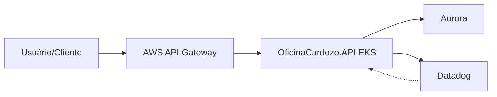

# OficinaCardozo.App

## Descrição
Repositório principal da aplicação Oficina Cardozo. Responsável pela API, lógica de negócio, integrações e execução do serviço principal em ambiente Docker/Kubernetes.

## Tecnologias Utilizadas
- .NET
- Docker
- Kubernetes (EKS)
- AWS Aurora
- Datadog

## Passos para Execução e Deploy
1. Clone o repositório.
2. Configure as variáveis de ambiente e arquivos de configuração.
3. Execute `docker-compose up` para ambiente local ou utilize os manifests do diretório k8s/ para deploy em EKS.
4. Acompanhe logs e métricas via Datadog.

## Diagrama da Arquitetura

## Documentação da API
- [Swagger Homologação](http://a85fc4063a2e04d7588978c9cc1e0527-1865379925.us-east-1.elb.amazonaws.com/swagger)
- [Swagger Produção](http://a33f79c8097bd4b22ace0ff7898e21e0-1554641145.us-east-1.elb.amazonaws.com/swagger)
- [Coleção Postman](./docs/postman_collection.json)
